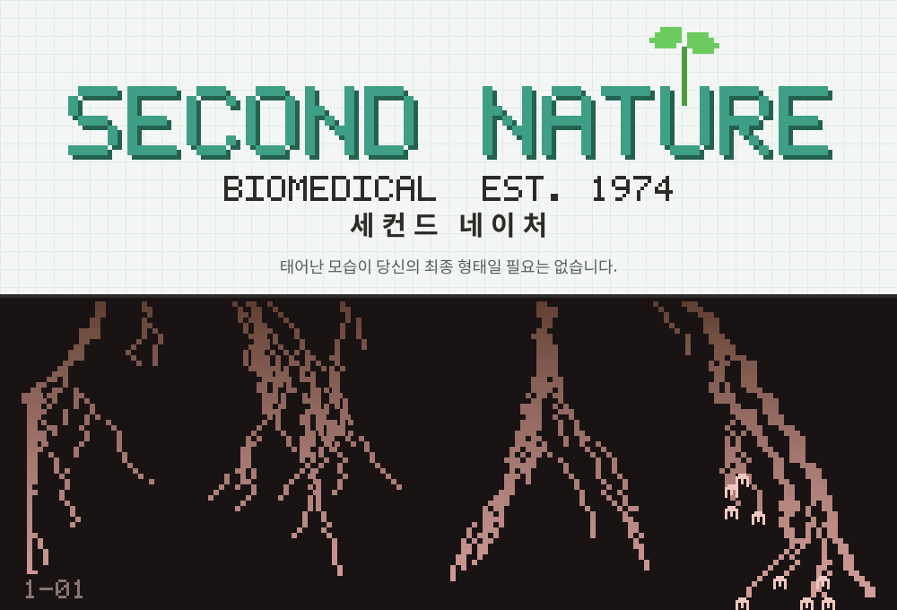

# SECOND NATURE (세컨드 네이처)



> **태어난 모습이 당신의 최종 형태일 필요는 없습니다.**

2009년 추수감사절 다음 날 새벽, 8년 전 문을 닫은 의료 연구단지의 공중전화에서 911 신고가 걸려 온다.
"도와주세요. 여기서 나가고 싶어요. 집에 가고 싶어요."
출동한 구급대원은 그곳에서 이 시설에서 유일하게 멀쩡해 보이는 여자아이, 우나를 만난다.
그리고 회사가 아이들을 고칠 때 쓰던 기기, **재지시기**로 몸에 남은 '지시'를 하나씩 읽어 간다.
흉터 하나 없는 몸들. "처음부터 이렇게 자란 몸이었다." 그 지시 기록 속에는 자기 왼팔도 있다.

- 장르: 1인칭 챕터제 호러 (5챕터 중 **챕터 1 플레이 가능**)
- 배경: 미국 애팔래치아의 가상 마을 매로우 크릭 / 게임 언어: 한국어
- 그래픽: 저해상도 레트로 렌더 + 3D 캐릭터, 실시간 그림자, PBR 재질 (R.E.P.O. 정도의 입체감)
- 소리: CC0 실제 악기 샘플(VSCO 2 Community Edition) + 악기·목소리 합성. 마이크는 쓰지 않는다
- 엔진: TypeScript + Three.js + Web Audio API + Vite
- 상태: **v0.4 — 챕터 1 「치료」** (프롤로그부터 크레딧까지, 약 40~60분)

## 실행

Node.js 20 이상이 필요하다.

```bash
npm install
npm run dev        # http://localhost:5173 — 개발 서버
npm run build      # 타입 검사 후 dist/ 에 빌드 (상대 경로라 어느 정적 호스팅에 올려도 된다)
npm run preview    # 빌드 결과 미리보기
```

헤드폰을 권장한다. 첫 화면을 클릭하면 소리가 시작된다.

## 조작

| 키 | 동작 |
|----|------|
| 마우스 | 둘러보기 |
| W A S D | 이동 |
| Shift | 달리기 (숨이 찬다) |
| Ctrl / C | 웅크리기 (통풍구) |
| E | 살피기, 사용, 우나에게 말 걸기, 테이프 건너뛰기 |
| F | 손전등 |
| Q (누르고 있기) | 우나의 손 잡기 — 회진이 나를 알아보지 못한다 |
| 왼클릭 (누르고 있기) | 재지시기 판독: 몸에 남은 지시를 읽는다 |
| 오른클릭 | 진정 카드 (3장): 회진과 호피 스와피를 잠깐 멈춘다 |
| 1 ~ 4 | 「호피의 건강 시간」 퀴즈 답 |
| H | 힌트: 지금 어디로 가서 무엇을 해야 하는지 |
| Esc | 일시정지 (설정: 음량, 감도, 화질, 난이도, 자막 크기) |

진행은 체크포인트마다 브라우저에 자동 저장된다. 제목 화면의 '이어하기'로 이어서 할 수 있다.
막히면 H를 누른다. 같은 목표에서 75초 넘게 진행이 없거나 잠긴 문을 열려고 하면 힌트가 저절로 뜬다.

## 설계 문서

전체 설계는 [`docs/design/00_INDEX.md`](docs/design/00_INDEX.md)에서 시작한다.
대설계 → 중설계 → 소설계의 트리 구조로 되어 있다.

| 문서 | 내용 |
|------|------|
| [01_CONCEPT](docs/design/01_CONCEPT.md) | 컨셉, 핵심 기둥, 이름, 로고, 톤·윤리 원칙, 원안과 확장 |
| [02_WORLD](docs/design/02_WORLD.md) | 핵심 공포와 현실의 뿌리, 세계의 규칙, 장소, 회사, 실험 연대기, 연표 |
| [03_CHARACTERS](docs/design/03_CHARACTERS.md) | 우나, 인물, 크리처 도감 |
| [04_GAMEPLAY](docs/design/04_GAMEPLAY.md) | 재지시기, 기록이 풀리는 구조, 우나와 함께, 퍼즐 |
| [05_CHAPTERS](docs/design/05_CHAPTERS.md) | 챕터 1~5, 엔딩 (챕터 1은 구현된 그대로) |
| [06_ART](docs/design/06_ART.md) | 아트 바이블, 흉터 없는 몸의 시각 규칙, 렌더링 규격 |
| [07_AUDIO](docs/design/07_AUDIO.md) | 사운드·음악 바이블, 메인 테마 악보, 샘플과 합성 |
| [08_PRODUCTION](docs/design/08_PRODUCTION.md) | 기술, 코드 구조, 마일스톤 |

## 코드 구조

```
src/
  main.ts          진입점 (글꼴 로드, 게임 또는 ?viewer)
  game.ts          게임 상태, 저장, 루프, 재지시기, 환경
  core/            렌더러·후처리, 입력, 걸음 박자
  audio/           오디오 버스·잔향, 합성, 효과음, 음악 시퀀서
  world/           레벨(방·문·충돌·길 찾기), 챕터 1 배치, 소품, 절차적 텍스처, 조명
  entities/        플레이어(1인칭 손), 우나, 회진, 호피 스와피, 캐릭터 모델
  gameplay/        챕터 스크립트, 상호작용, VHS 테이프, 프롤로그
  data/text.ts     모든 한국어 문자열
  ui/              HUD, 자막, 문서, 메뉴
public/audio/vsco/ 악기 샘플 (CC0) — LICENSE.txt
tools/             로고·테마 스케치·샘플 준비 스크립트
```

## 산출물 다시 만들기

```bash
python3 tools/brand/make_logo.py          # → assets/brand/second_nature_logo.svg
python3 tools/audio/make_theme_sketch.py  # → assets/audio/sketch/whatever_you_become_sketch.mid
python3 tools/audio/fetch_samples.py      # → public/audio/vsco/ (git, ffmpeg 필요)
```

## 라이선스와 출처

- 악기 샘플: [VSCO 2 Community Edition](https://github.com/sgossner/VSCO-2-CE) — CC0 1.0 (`public/audio/vsco/LICENSE.txt`)
- 글꼴: [갈무리 (Galmuri)](https://github.com/quiple/galmuri) — SIL Open Font License 1.1
- 3D: [three.js](https://threejs.org) — MIT
