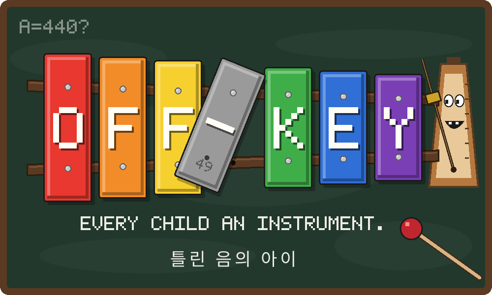

# OFF-KEY : 틀린 음의 아이



> **아이를 악기로 만든 학교에서, 박자 안에 숨어 살아남는 레트로 호러.**

*알레그레토 꼬마 음악원*의 악기들은 아이들의 몸으로 만들어졌다. 그리고 아이들은 아직 그 안에 살아 있다.
1996년 겨울 발표회 날 밤, 후원자 320명이 들어간 홀에서는 아무도 나오지 않았다.
10년 뒤, "음이 낮다"는 이유로 졸업 하루 전에 쫓겨났던 아이가 피아노 조율사가 되어 돌아온다.

- 장르: 1인칭 챕터제 호러 (5챕터)
- 그래픽: 발디의 수학교실 시절의 레트로 3D (빌보드 스프라이트, 저해상도 텍스처)
- 핵심: 박자에 맞춰 걸어 발소리를 숨기는 **박자 은신**, 학교가 아이들을 길들인 신호음을 녹음해 되돌려 쓰는 **공명기**
- 엔진: TypeScript + Three.js + Web Audio API
- 상태: **기획 단계 (v0.2)**

## 설계 문서

전체 설계는 [`docs/design/00_INDEX.md`](docs/design/00_INDEX.md)에서 시작한다.
대설계 → 중설계 → 소설계의 트리 구조로 되어 있다.

| 문서 | 내용 |
|------|------|
| [01_CONCEPT](docs/design/01_CONCEPT.md) | 컨셉, 핵심 기둥, 이름, 로고, 차별화, 톤 |
| [02_WORLD](docs/design/02_WORLD.md) | 핵심 공포와 현실의 뿌리, 세계의 규칙, 장소, 연표, 미스터리 |
| [03_CHARACTERS](docs/design/03_CHARACTERS.md) | 인물, 크리처 도감 |
| [04_GAMEPLAY](docs/design/04_GAMEPLAY.md) | 게임 시스템 |
| [05_CHAPTERS](docs/design/05_CHAPTERS.md) | 챕터 1~5, 엔딩 |
| [06_ART](docs/design/06_ART.md) | 아트 바이블, 바디 호러 시각 규칙 |
| [07_AUDIO](docs/design/07_AUDIO.md) | 사운드·음악 바이블, 메인 테마 악보, 아이들의 노래 |
| [08_PRODUCTION](docs/design/08_PRODUCTION.md) | 기술, 마일스톤 |

## 산출물 다시 만들기

```bash
python3 tools/brand/make_logo.py          # → assets/brand/offkey_logo.svg
python3 tools/audio/make_theme_sketch.py  # → assets/audio/sketch/lesson49_sketch.mid
```

두 스크립트 모두 파이썬 표준 라이브러리만 쓴다.
